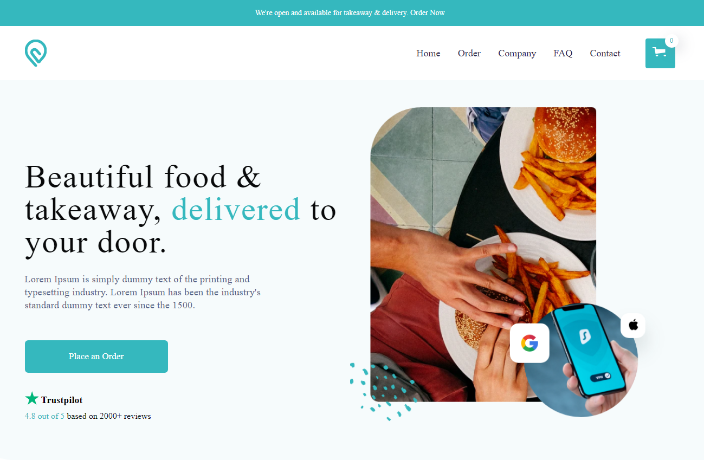

# Food delivery site on vue2 and vuex

[Watch here](https://turdiev.github.io/burgers-shop/)

## Tools

- [Vue CLI](https://cli.vuejs.org/)
- [Vue2](https://v2.vuejs.org/v2/guide/)
- [Vuex](https://vuex.vuejs.org/)
- [Vue Router](https://router.vuejs.org/introduction.html)
- [Gsap](https://greensock.com/docs/)

## Usage

After installing the dependencies the following NPM scripts become available:

- `serve`: starts the application in development mode on [http://localhost:8080](http://localhost:9000)
- `build`: bundles the application for production into the `dist` folder
- `lint`: lint